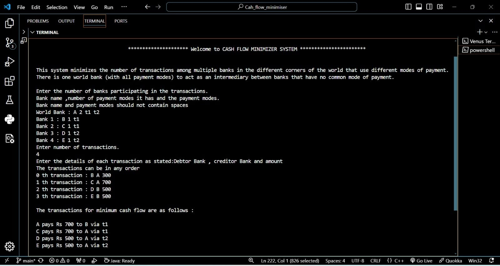

# Welcome to Cash Flow Minimiser
This system minimizes the number of transactions among multiple banks in the different corners of the world that use different modes of payment. There is one world bank (with all payment modes) to act as an intermediary between banks that have no common mode of payment.

## How it works
Each Bank only supports a set of modes of payments and can make or receive payments only via those. Only World Bank suppports all modes of payments.
You have to give the input of the bank name their income with the mode of payment they allow.

Let's take an example:
We have these banks let say:
1.World Bank -: A
2.Bank -: B
3.Bank -C
4.Bank -D
5 Bank - E

Following are the payments to be done:  
     &emsp;&emsp;&emsp;    **Debtor Bank**&emsp;&emsp;&emsp;&emsp;&emsp;&emsp;&emsp;&nbsp;                **Creditor Bank** &emsp;&emsp;&emsp;&emsp;&emsp;&emsp;&emsp; **Amount**
1. B   &emsp;&emsp;&emsp;&emsp;&emsp;&emsp; &emsp;&emsp;&emsp;&emsp;&nbsp;&nbsp;&nbsp; &emsp;&emsp;&emsp;&emsp;&emsp;             A &emsp;&emsp;&emsp;&emsp;&emsp;&emsp;&nbsp;&nbsp;&nbsp;  &emsp;&emsp;&emsp;            Rs 300
2. C   &emsp;&emsp;&emsp;&emsp;&emsp;&emsp; &emsp;&emsp;&emsp;&emsp;&nbsp;&nbsp;&nbsp; &emsp;&emsp;&emsp;&emsp;&emsp;             A &emsp;&emsp;&emsp;&emsp;&emsp;&emsp;&nbsp;&nbsp;&nbsp;  &emsp;&emsp;&emsp;            Rs 700
3. D   &emsp;&emsp;&emsp;&emsp;&emsp;&emsp; &emsp;&emsp;&emsp;&emsp;&nbsp;&nbsp;&nbsp; &emsp;&emsp;&emsp;&emsp;&emsp;             B&emsp;&emsp;&emsp;&emsp;&emsp;&emsp;&nbsp;&nbsp;&nbsp;  &emsp;&emsp;&emsp;            Rs 500
4. E   &emsp;&emsp;&emsp;&emsp;&emsp;&emsp; &emsp;&emsp;&emsp;&emsp;&nbsp;&nbsp;&nbsp; &emsp;&emsp;&emsp;&emsp;&emsp;             B&emsp;&emsp;&emsp;&emsp;&emsp;&emsp;&nbsp;&nbsp;&nbsp;  &emsp;&emsp;&emsp;            Rs 500

Following is the list of Banks and their supported payment modes :

1.&emsp;  A(World_bank)  &emsp;&emsp;- &emsp; Google_Pay,  Paytm 
2.&emsp;B &emsp;- &emsp; Google_Pay,  
3.&emsp;C &nbsp;&emsp;- &emsp; Google_Pay 
4.&emsp;D &emsp; - &emsp;  Paytm 
5.&emsp;E  &emsp;- &emsp; Paytm

To pick the first Bank, we calculate the **net amount** for every Bank by using the below formula and store them in list:

net amount = [Sum of all **credits**(_amounts to be received_)] - [Sum of all **debits**(_amounts to pay_)]

Now the idea is that we are finding the bank which has _minimum_ net amount(_max debtor_) (_say Bank X, net amount x_) and then finding the bank which has the _maximum_ net amount( _max creditor_) (_say Bank Y, net amount y_) and also has a common payment mode (_say M1_) with the former bank. Then we find _minimum_ of absolute value of x and y, lets call it z.\
Now X pays the amount z to Y. Then 3 cases may arrived:
1. If (magnitude of x) < y  =>  X is completely settled and so removed from the list.
2. If (magnitude of x) > y  =>  Y is completely settled and so removed from the list.
3. If (magnitude of x) = y  =>  X and Y both are completely settled and so both are removed from the list.

The same process is repeated for the remaining banks.

Below is the execution of our current example:

    

###  How to use it
All the instructions are given while you are executing the code  it will guide you to the final output.

**Thank You!**

